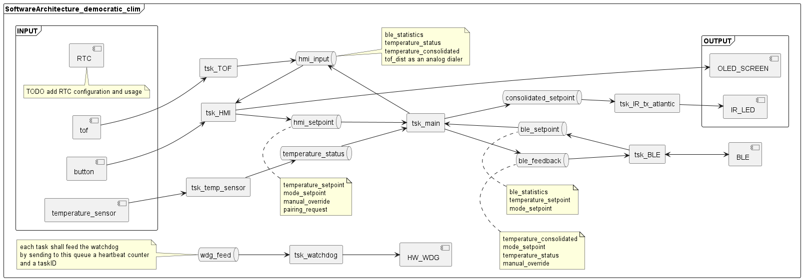
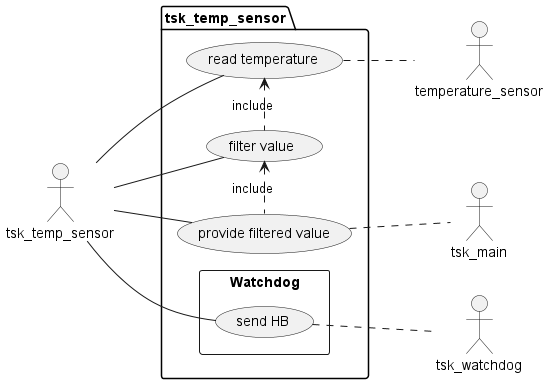
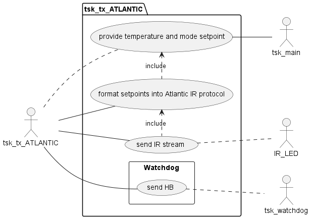
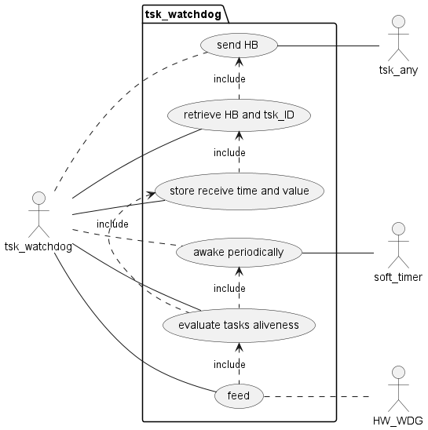

# 1)Architecture diagram

Use plant UML to generate puml diagrams (A plantUml plugin for visual studio (by jebbs) is available and allow realtime rendering of diagram)

The main software consist of multiple task having each a restrained area of expertise:
- The tsk_HMI is in charge of interracting with the user.
    - It shall serve the IRQ comming from the button B1 and B2
    - It shall consume distances information and convert them to analog value, used to fine change settings value
    - It shall initialize and drive the OLED screen
    - It shall handle the different screen and provide a convenient way to go through them
    - It shall be easy to add a new screen
    - It shall receive feedback data in order to update data shown on screen
    - It shall send sepoint to the main task
    - It shall periodically feed the tsk_wdg, in order to show it's aliveness
- The tsk_temp_sensor is in charge of retrieving the ambient temperature

    - It shall periodically read the temperature of the sensor (using I2C)
    - It shall filter value 
    - It shall transmit the filtered value to the tsk_main
    - It shall periodically feed the tsk_wdg, in order to show it's aliveness
- The tsk_main is the main task of the project, centralizing all needed information to create the democratic part of the project
    - It shall receive ambient temperature data
    - It shall receive setpoints and command from tsk_HMI
    - It shall provide feedback data to the tsk_HMI
    - It shall receive setpoints from tsk_BLE
    - It shall provide feedback data to the tsk_BLE
    - It shall consolidate a setpoint and provide it to the tsk_IR_tx_atlantic
    - It shall periodically feed the tsk_wdg, in order to show it's aliveness
- The tsk_IR_tx_atlantic is in charge of formating the setpoint to a valid IR frame and send it over IR 
    - It shall receive the temperature and air conditionning mode from the tsk_main
    - It shall format the data into a valid Frame
    - It shall transmit the frame over IR
    - It shall periodically feed the tsk_wdg, in order to show it's aliveness

- The tks_BLE is in charge of handling the BLE communication
    - It shall allow up to 8 device to be connected simultanously
    - It shall provides feedack (ambient temperature, setpoint) using advertising frame
    - It shall receive setpoint from connected devices
    - It shall monitor presence of previously connected devices (using RSSI)
    - It shall notify tsk_main of any disconnection of if a device is too far away

- The tsk_watchdog is in charge of centralizing hearbeats from each tasks and to feed the hardware watchdog

    - The init of the hardware watchdog is performed prior launching RTOS scheduler
    - It shall receive the heartbeats in conjunction with task_ID from other tasks
        - it shall store the receive time, if the hb value is different than the one previously received
        - it shall save the new hb value
    - Periodically, it shall check whether all task provided a valid hb since the last periodic check
        - it shall feed the hardware watchdog if all task were alive
    - It shall provide a way for some tasks to be non monitored (e.g. debug task or loging tasks if any)

## 2)Needs | Requirements
The requirement of the software can be found in the following doccument: [Needs](./_Needs.md)

## 3)Timing constraints

No timing constraints

