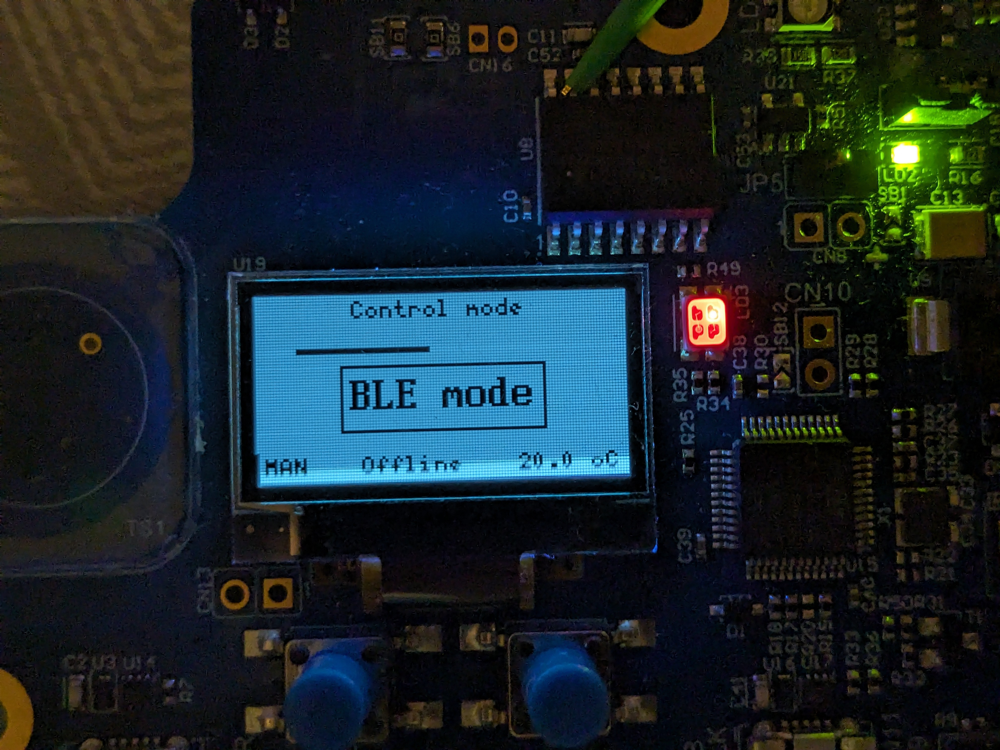
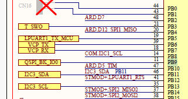
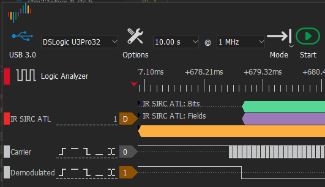
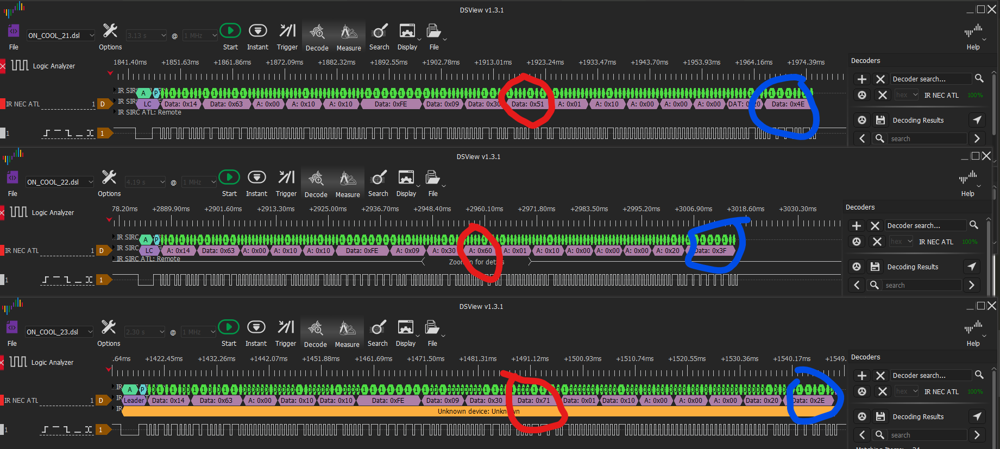
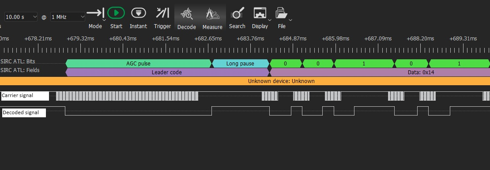
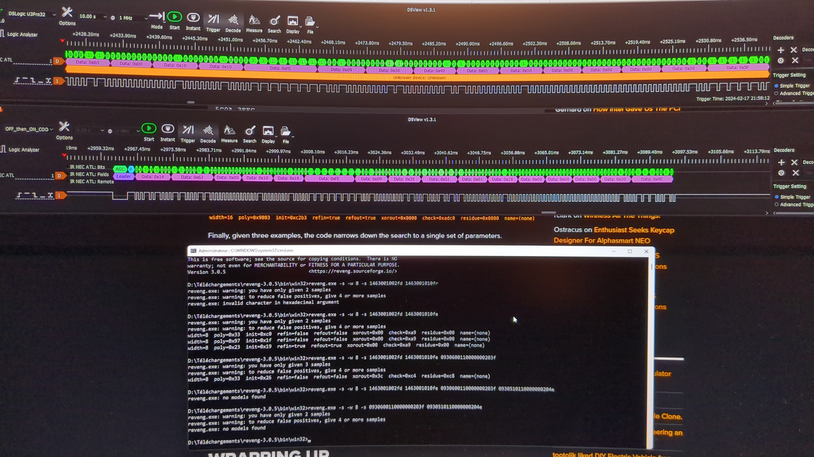
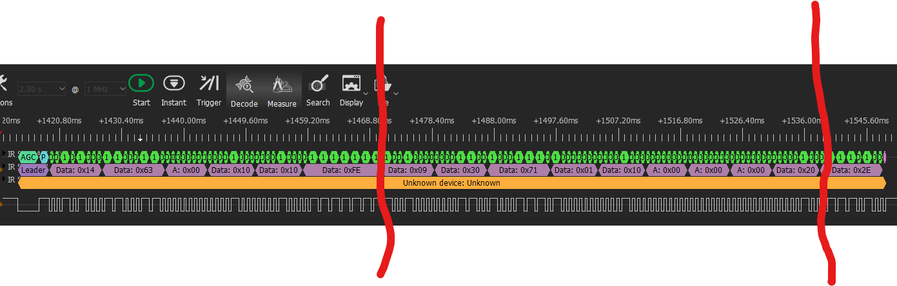
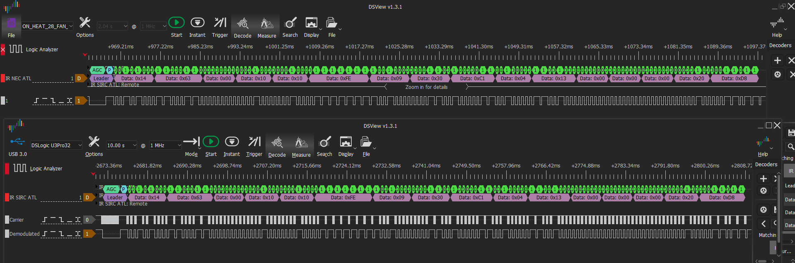
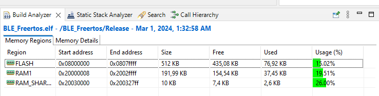

# Elektor Democratic Clim

## 1) Project description
This project aims to create a democratic tools for controlling airconditionning temperature in open spaces with multiples coworkers. 

The system allows two mode :
- **Manual**, to be used if someone is just using the space part time, override all setting (similar to an IR remote)
- **BLE**, allows up to 8 smartphone to be connected and to choose a temperature. 
-- The temperature is selected based on the temperature choosen and the smartphone near the device (accomodate for people going in or out of the space) 
-- The temperature setpoint is either a mean value or a median value (to be decided)
-- The mode of the Air conditionning (heating or cooling) is automaticaly chosen by the software (by using the ambient temperature)

It is also using STM32 BLE chips in order to particiape to the STM32 contest held at Elektor magazine

Only the IR part of the project is specific to the Atlantic air conditionning system. The rest can be reused at will for any similar project or to recreate an IR remote.

### 1.1) Future evolution

The following feature would be neat:
- Automatically switch OFF and ON the AC at a preprogrammed hour, in order to reduce power consumption
- Save settings to RTC register or to eeprom, in order to remember the previous data in case of a power loss
- To be completed 

## 2) Project status

Realised:
- Watchdog task is created and monitor each task requesting to be monitored
- TOF task initialises TOF sensor and send periodic distance to HMI task
- BTN initialised and sending 'top' to the HMI task 
- HMI task initialises OLED screen and receive information from Btn/TOF and Main task feedback
- HMI task handles transition betweend different screens and handles edition of values
- HMI task accept any number of screens, and roll back to first screen after 10s (rollback not performed during edition)
- HMI task sends setpoint to Main TASK
- Temperature task initialises temperature sensor, filters value and send periodic temperature to MAIN task
- Main task retrieves setpoint from HMI
- Main task receives ambient temperature
- Main task provide feedback to HMI task
- Capture and reverse engineering of the Atlantic IR remote protocol
- IR task created
- IR task generate bitstream to be send over IR
- Compute of the IR checksum, and append it to the end of the frame (to be tested with air conditionning system)

Ongoing:
- Documentation describbing the IR protocol

To be done:
- Fix Font in order to support the ° character
- BLE communication, but the BLE stack is up and running, needs to be configured
- Smartphone application
- Hardware watchdog configuration and feeding

## 3) HMI behaviour

The HMI consists of two buttons, a TOF (distance) sensor used as analog input and an OLED screen.

### 3.1) Screen composition

The screen is based on widget. 
A widget located at the top of the screen is used to display the screen title (could be empty if an empty string is provided)
At the bottom, a widget status bar is created and indicates:
- The Control mode: BLE (smartphones) or manual by using HMI
- The actual mode of the air conditionning system: Offline, Cooling or heating
- The temperature setpoint in °C

The middle of the screen is left unused for each specific screen needs

# 3.2) Buttons and TOF sensor

The Left button (B1) serve two purposes: 
- it is used to navigate through all screen (in a carousel) 
- During edition, it is used to cancel an ongoing edition and going to the next screen

The Right button (B2) serve two purposes:
- Enter in edition mode (if the current screen allow such action)
    A value being edited has the border of it's widget visible
- Validate the value set 

The TOF sensor is used to measure distance between the board and the user's hand.
As it is difficult to finaly adjust value without any help, a progress bar appears on screen (representing the distance) when the edition mode is ongoing

## 5) Atlantic Air conditionning IR remote protocol reverse engineering

### 5.1) How to reverse an unknown protocol (and also invisible)
#### 5.1.1) How to spy on the signals ?
 There are two possibilities:
 - Either procure a IR receiver pcb board. These are handy board with just 3 pin (Gnd, 3.3V or 5V and output). Theses boards cost 5€ (some even have a LED glowing when an IR frame is received) and can be connected directly to a microcontrolleur. They remove the carrier signal of the IR signal and only leaves the data. You can hook the output directly to a logic analyser. The only drawback, with this module is that you won't be able to observe the carrier signal and will have no clue for the carrier frequency.
 - Otherwise you can tear down the packaging (in the i.Fixit way using screwdriver and spugler) of your IR remote and hook the logic analyser directly on the Anode and Kathode of the IR LED. The drawback is you will have to mentally remove the carrier.

 The best is of course to be able to hook le IR-LED and the PCB module at the same time to a logic analyser. If you do not power both board from the same power supply, do not forget to link together the ground of each board.
 
 I have the chance to have an overkill for the task DreamSourceLab  logic analyser capable of 32 lanes, which proved handy for retrocomputing. However for such task an 8 channel, 24Mhz logic analyser  cost only15€ and can be used free of charge with PulseView/SigRock

In order to spy on the carrier, I had to spy on the PB9 (IR_OUT) pin of the STM32 which happend to be shared with the quad SPI (thanks to the schematics)

The resulting picture showing the dev environnement for this project (quite messy)

 Once everything is setup, it's time to capture
 
 #### 5.1.2) How to capture ?

Use either GNU PulseView/Sigrock or in my case DSView to capture signals. 
The important thing to find a sweet spot between frequency of acquisition and buffer size. Cheap logic analyser tend to limit greatly the buffer memory. This can be circumvent with triggers. however it can be difficult if we have no idea of what the signals might look like.

In my case, the remote takes 1 to 2 seconds after a change on the screen prior to transmit over IR. So I choose 10 s of sampling duration.
Then for the Frequency I chose 10Mhz but using Nyquist-Shannon Theorem and knowing IR carrier is usually aroud 38kHz (less than 50kHz) a sampling frequency of 100Khz should have been sufficient (50kHz * 2)

Then it's only a matter of syncrhonisation between starting the capture and pushing button on the remote.

##### 5.1.3) What to capture

In order to discover the protocol, we need a lot of information. 

The first step is to list what data do you want to observe, you do not need to completely understand the protocol, just the bit that you're interested into

In the case of the Atlantic IR remote, I needed to detect the following information:
- temperature
- fan mode
- swing mode
- air conditionning mode
- eco mode

For each elements listed in the list you need to performe a capture by changing only one parameter at a time. In the case of the temperature, I tested some temperature value, by incrementing of one degree at a time.

Here you can observe a dual capture, one at 21° and one at 22 and one at 23.Observe the location of the changing value and try to see if it make sens (circled in red) Here the temperature is coded in the 4 Most significant bit. Val 5 for 21, 6 for 22, and 7 for 23. Now if we consider that there might be a minimum viable temperature, this one could be used as an offset. Here the offset is 16°C. If you want 16°, you have to send a val of 0, 17° you need to send a value of 1 and so on.

You can also see that the last byte changed (circled in blue) of value but in a strange value. This is the checksum/crc. These are needed to detect whether the transmission was coherent (and the value can be accounted for). These might be difficult to reverse but all hope is not lost.

Well you might say: "Hey, in your case it is simple, you can see the bytes value directly. But if I try on my side, I only have pulses and no clue how to read them" (and if y try by hand, you surely will make mistakes)

##### 5.1.4) I have nice Waveform (more like pulses), now what ?

The important tools embedded with logic analyser is their ability to decode protocol so we don't need to do it manually.
In the case of DSview and Sigrock, this is done with decoders written in Python.

As I'm lazy, I choose to reuse the SIRC decoder (as the signals were near) and adpat it for my needs. For this I had to tune the bit timings which was not the same. The bit timing were shorter in the case of the Atlantic IR remote (it makes sens since this remote has a lot of data to transfer). 

Observing the generated signal, it was obvious a start sequence was present : A long wakeup signal (carrier transmitted for 3.8 ms)  followed by a pause (no carrier for 1.5ms), then the first bit.

Fun fact, the bit are always  send by togling 'low and high' the data signal or in case of the carrier, carrier and no carrier. The bit value is indicated by the length of the pause after a fixed in size carrier pulse. 
Hence a 0 is coded by applying carrier for 400 us then 400us of pause
a 1 is coded by applying carrier for 400 us then 1 ms of pause.

Here is an example of an acquisition : 

##### 5.1.5) How to recompute the checksum ?

In some cases you simply can't as the algorithm is too complex. If such case occurs, you can always store a table with all precalculated frames (if you only need very few command, you managed to record previously). However this method can be time costly and will consume lots of ROM memory

In my case, I do not wanted the previous and simple solution so I tried first some common tools that tries multiple combination of many possible CRC pattern. The tool I used is "reveng" but this attemts was not successfull.

Finaly playing with different value in the frame, I observed that only the 4 MSB or 4 LSB part will change according if any of the prior MSB or LSB part of the message had changed. So it not one but two checksum !

By changing only a value of 1 increment, the "sub" checksum will decrement of 1.
The starting value of this checkum is 0b1111 (for the MSB and for the LSB). If the value is completely decremented, then roll back to the value 15 and keep substracting.
Example : 

Computing the MSB value between the two red portion (the left part is the header of the IR frame and is already protected by a checksum (0xFE): It's purpose is to indicate to the air conditionner that it will be ON with some setpoint value following)
Using the previously  mentionned algo: 15 - 0 - 3 - 7 - 0 - 1 - 0 - 0 - 0 - 2 => 2

### 5.2) How to reimplement the protocol ?

See the tsk_IR_ATL.c file for the protocol implementation
See the ir_atl_encode.c for the IR frame transmission using the IR_out of the STM32

### 5.3) Final results

Here is an example comparing a frame recorded from an standard Atlantic IR remote, and below the results generated dynamically (after setting value into the HMI)

## 6) Documentation 
### 6.1) Software Architecture

The software architecture is available at [./Documentation/Technical_Documentation/Architecture/_Architecture.md](./Documentation/Technical_Documentation/Architecture/_Architecture.md)
Diagrams are in plantuml and are available at ./Documentation/Technical_Documentation/Architecture/

### 6.2) Project folders
**Documentation/Datasheets** folder provides all documentation provided by STM32
**Documentation/Internal_Documentation** folder provides source template and coding rules
**Documentation/Reverse_atlantic_protocol** folder provides captures and interpretation of Atlantic IR transmission
**Documentation/Technical_Documentation** folder provides the architectures and specification of the software

**Sources/MCU/BLE_Freertos** contains the software for the STM32WB5MM-DK board. The folder structure is the same as the one generated by STM32CubeIDE using IOC file to configure clock/GPIO...
**Sources/MCU/BLE_Freertos/3rdparty** contains a gragphic library and widget library specialy tuned toward monochromatic graphic display such as tiny OLED screen (developped prior and updated during this project)
**Sources/MCU/BLE_Freertos/Core/task** contains all specific task and code created for this project.

**Sources/tools** folder provides tools needed to realise this project (e.g. IR decoder for DSView logic analyser )

**Bin/MCU** folder will provide an .hex file containing the last compiled version of the software 

## 7) Quick developping start guide

The software is build using STM32Cube IDE V1.13.2
**/!\\** Some file generated by cubeIDE and are modified afteward (spi.c and i2c.c) in order to remove MX_SPI1_Init and MX_I2C3_Init (If these file are not generated then HAL_spi and HAL_i2c file are not imported into the project)

## 8) Ressources usage
In release mode, the project is pretty lightweight (could be less heavy by reimplementing HAL library with less genericity), there won't be any problem to implement BLE and add new features

